# RAGFlow 系统架构文档

## 目录
- [系统概述](#系统概述)
- [整体架构](#整体架构)
- [核心模块架构](#核心模块架构)
- [API 功能列表](#api-功能列表)
- [数据流](#数据流)

---

## 系统概述

RAGFlow 是一个基于深度文档理解的开源 RAG（检索增强生成）引擎。采用微服务架构，支持 Docker 部署。

**技术栈：**
- 后端：Python 3.10-3.12, Flask/Quart
- 前端：React 18, TypeScript, UmiJS
- 数据存储：MySQL, Elasticsearch/Infinity, Redis, MinIO
- 容器化：Docker, Docker Compose

---

## 整体架构

### 系统架构图

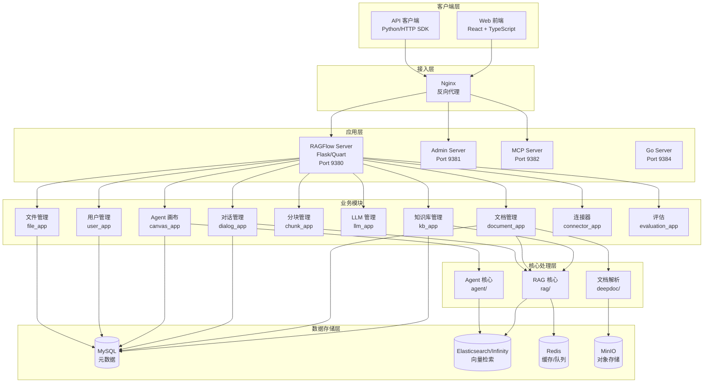

### 微服务组件图

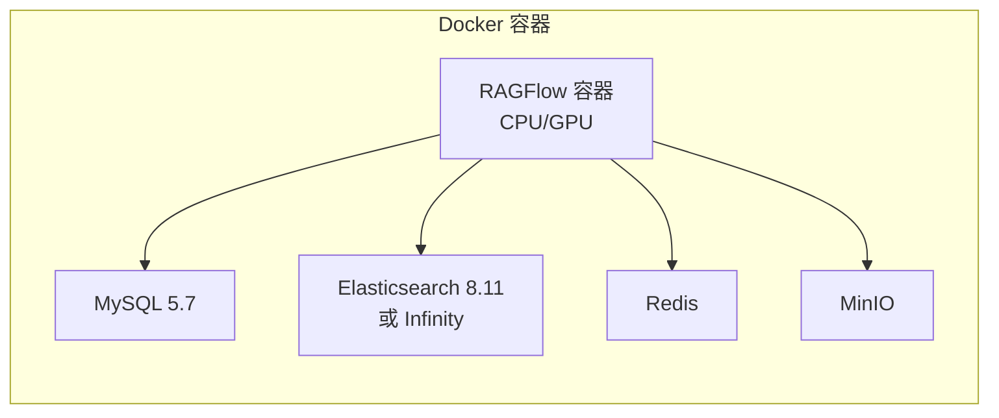

---

## 核心模块架构

### 1. RAG 核心模块 (rag/)

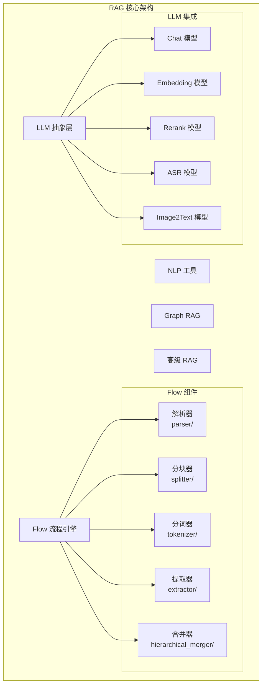

**主要功能：**
- 文档解析与分块
- 向量化与检索
- LLM 调用抽象
- 知识图谱构建
- 高级 RAG 策略

### 知识图谱与 GraphRAG

RAGFlow 的知识图谱能力构建在 `rag/graphrag/` 之上，面向知识库级别的多跳检索与复杂推理场景。它不是单纯将实体关系抽出来展示，而是将图谱构建、图谱合并、实体消歧、社区摘要和查询增强串成一个完整流程。

**核心能力：**
- 按文档构建子图，再合并为知识库级总图
- 支持 `light` 与 `general` 两种抽取方法
- 支持自定义实体类型（默认包括 organization、person、geo、event、category）
- 支持实体消歧（Entity Resolution），合并同名或近义实体
- 支持社区发现与社区报告（Community Report）生成
- 图谱结果写回检索存储，可用于可视化和后续检索增强

**图谱存储对象：**
- `graph`：知识库级总图，供知识图谱页面展示
- `subgraph`：单文档生成的子图
- `entity`：实体节点
- `relation`：实体关系边
- `community_report`：社区级摘要报告

**配置入口：**
- 数据集设置页可以触发知识图谱生成任务，而不是简单开关
- 可配置抽取方法 `light/general`
- 可配置 `entity_types`
- 可选开启 `resolution` 和 `community`

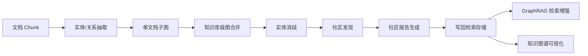

### RAPTOR 分层摘要

RAPTOR 实现在 `rag/raptor.py` 中，用于把底层 chunk 递归聚类并逐层摘要，生成一棵面向检索的层次化语义树，适合多跳问答、长文档概览和跨段落综合问题。

**工作机制：**
- 对 chunk 先做 embedding 编码
- 用 UMAP 降维后做高斯混合聚类（GMM）
- 在每一层对聚类结果调用 LLM 生成摘要
- 将摘要重新编码后作为上一层节点继续聚类
- 直到无法再向上聚合，形成层次化摘要树

**关键配置：**
- `scope`：针对整个知识库或单个文件生成
- `prompt`：每个聚类的摘要提示词
- `max_token`：单次摘要生成的输出上限
- `threshold`：聚类归属阈值，影响每簇大小
- `max_cluster`：聚类数上限
- `random_seed`：聚类随机种子
- `auto_disable_for_structured_data`：结构化数据场景下可自动关闭

**适用场景：**
- 多跳问答
- 跨章节归纳总结
- 长文档的分层概览
- 需要先抽象后检索的复杂问题

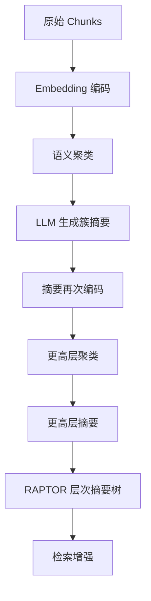

### 2. Agent 系统模块 (agent/)

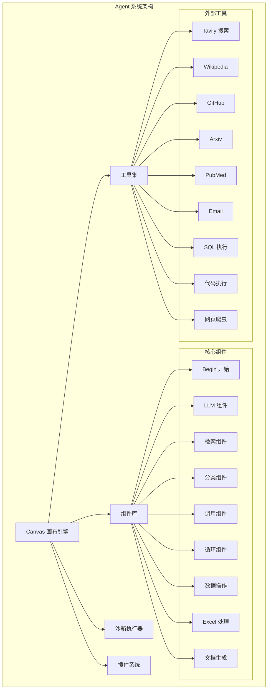

**主要功能：**
- 可视化工作流编排
- 多步骤 Agent 执行
- 外部工具集成
- 代码沙箱执行
- 插件扩展机制

### 3. 文档处理模块 (deepdoc/)

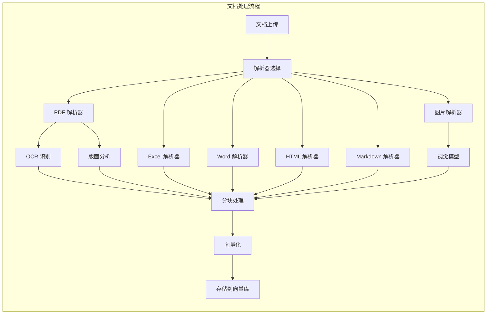

**支持的文档类型：**
- PDF, DOCX, PPTX, XLSX
- TXT, MD, JSON, EML
- HTML, CSV
- 图片 (JPG, PNG, etc.)

### 4. 用户与权限管理

RAGFlow 的用户与权限体系基于“用户 - 租户 - 资源”三层模型。大多数业务接口通过 `@login_required` 统一鉴权，请求既可以来自 Web 会话，也可以通过 `Authorization` 头携带 API Token 访问。

**认证方式：**
- 邮箱 + 密码登录
- 第三方 OAuth / OIDC 登录
- 会话态访问（浏览器登录后）
- API Token 访问（适用于脚本、SDK、服务集成）

**租户与团队模型：**
- 每个用户至少归属于一个租户
- 租户成员角色包括 `owner`、`admin`、`normal`、`invite`
- 团队邀请通过 `tenant_app` 管理，成员接受邀请后加入租户
- 资源默认归属于租户，再由资源自身的权限字段决定共享范围

**资源权限模型：**
- `me`：仅资源所属租户/拥有者可见
- `team`：同租户成员可访问
- 数据集、文件、Canvas 等资源都依赖租户成员关系做访问校验
- 部分高风险操作要求资源 owner 身份，例如删除或修改关键配置

**API Token 机制：**
- Token 由租户 owner 创建
- Token 绑定到租户，用于无状态 API 调用
- 服务端会将 Token 解析到对应租户用户上下文，再执行后续权限判断

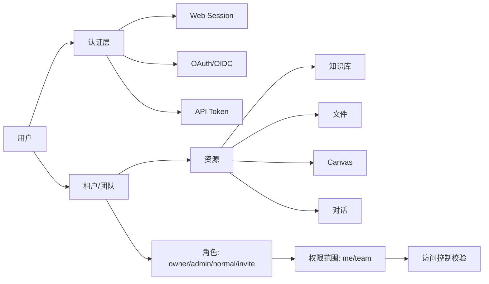

---

## API 功能列表

RAGFlow 提供了 200+ REST API 接口，分为以下模块：

### 1. 知识库管理 API (kb_app)

**基础操作：**
- `POST /v1/kb/create` - 创建知识库
- `POST /v1/kb/update` - 更新知识库配置
- `POST /v1/kb/update_metadata_setting` - 更新元数据设置
- `GET /v1/kb/detail` - 获取知识库详情
- `POST /v1/kb/list` - 列出知识库
- `POST /v1/kb/rm` - 删除知识库

**标签管理：**
- `GET /v1/kb/<kb_id>/tags` - 获取知识库标签
- `GET /v1/kb/tags` - 获取所有标签
- `POST /v1/kb/<kb_id>/rm_tags` - 删除标签
- `POST /v1/kb/<kb_id>/rename_tag` - 重命名标签

**知识图谱：**
- `GET /v1/kb/<kb_id>/knowledge_graph` - 获取知识图谱
- `DELETE /v1/kb/<kb_id>/knowledge_graph` - 删除知识图谱
- `POST /v1/kb/run_graphrag` - 运行 GraphRAG
- `GET /v1/kb/trace_graphrag` - 追踪 GraphRAG 进度

**高级功能：**
- `POST /v1/kb/run_raptor` - 运行 RAPTOR
- `GET /v1/kb/trace_raptor` - 追踪 RAPTOR 进度
- `POST /v1/kb/run_mindmap` - 生成思维导图
- `GET /v1/kb/trace_mindmap` - 追踪思维导图生成
- `POST /v1/kb/check_embedding` - 检查嵌入模型

**说明：**
- GraphRAG 与 RAPTOR 都以异步任务方式执行，接口首先返回 `*_task_id`
- 任务状态通过 `trace_graphrag`、`trace_raptor` 轮询
- GraphRAG 面向知识库内全部文档统一构图；RAPTOR 支持知识库级或单文件级生成
- 知识图谱查询接口会返回裁剪后的节点与边，默认面向可视化展示而非完整导出

**日志管理：**
- `POST /v1/kb/list_pipeline_logs` - 列出流水线日志
- `POST /v1/kb/list_pipeline_dataset_logs` - 列出数据集日志
- `POST /v1/kb/delete_pipeline_logs` - 删除日志
- `GET /v1/kb/pipeline_log_detail` - 获取日志详情

### 2. 文档管理 API (document_app)

**文档上传：**
- `POST /v1/document/upload` - 上传文档
- `POST /v1/document/web_crawl` - 网页爬取
- `POST /v1/document/create` - 创建文档
- `POST /v1/document/upload_and_parse` - 上传并解析
- `POST /v1/document/parse` - 解析文档

**文档查询：**
- `POST /v1/document/list` - 列出文档
- `POST /v1/document/filter` - 过滤文档
- `POST /v1/document/infos` - 获取文档信息
- `GET /v1/document/get/<doc_id>` - 获取文档详情
- `GET /v1/document/thumbnails` - 获取缩略图

**文档操作：**
- `POST /v1/document/rm` - 删除文档
- `POST /v1/document/run` - 运行文档处理
- `POST /v1/document/rename` - 重命名文档
- `POST /v1/document/change_status` - 更改状态
- `POST /v1/document/change_parser` - 更改解析器

**元数据管理：**
- `POST /v1/document/metadata/summary` - 元数据摘要
- `POST /v1/document/metadata/update` - 更新元数据
- `POST /v1/document/update_metadata_setting` - 更新元数据设置
- `POST /v1/document/set_meta` - 设置元数据

**资源访问：**
- `GET /v1/document/download/<attachment_id>` - 下载附件
- `GET /v1/document/image/<image_id>` - 获取图片
- `GET /v1/document/artifact/<filename>` - 获取制品

### 3. 对话管理 API (dialog_app)

**对话配置：**
- `POST /v1/dialog/set` - 创建/更新对话
- `GET /v1/dialog/get` - 获取对话配置
- `GET /v1/dialog/list` - 列出对话
- `POST /v1/dialog/rm` - 删除对话
- `POST /v1/dialog/next` - 获取下一个对话

### 4. 会话管理 API (conversation_app)

**会话操作：**
- `POST /v1/conversation/set` - 创建/更新会话
- `GET /v1/conversation/get` - 获取会话
- `GET /v1/conversation/getsse/<dialog_id>` - SSE 流式获取
- `POST /v1/conversation/rm` - 删除会话
- `GET /v1/conversation/list` - 列出会话

**对话交互：**
- `POST /v1/conversation/completion` - 对话补全
- `POST /v1/conversation/ask` - 提问
- `POST /v1/conversation/mindmap` - 生成思维导图
- `POST /v1/conversation/related_questions` - 相关问题推荐

**消息管理：**
- `POST /v1/conversation/delete_msg` - 删除消息
- `POST /v1/conversation/thumbup` - 点赞/点踩
- `POST /v1/conversation/sequence2txt` - 序列转文本
- `POST /v1/conversation/tts` - 文本转语音

### 5. Agent 画布 API (canvas_app)

**画布管理：**
- `GET /v1/canvas/templates` - 获取模板
- `POST /v1/canvas/set` - 创建/更新画布
- `GET /v1/canvas/get/<canvas_id>` - 获取画布
- `GET /v1/canvas/getsse/<canvas_id>` - SSE 流式获取
- `GET /v1/canvas/list` - 列出画布
- `POST /v1/canvas/rm` - 删除画布

**执行控制：**
- `POST /v1/canvas/completion` - 执行画布
- `POST /v1/canvas/<canvas_id>/completion` - 执行指定画布
- `POST /v1/canvas/rerun` - 重新运行
- `PUT /v1/canvas/cancel/<task_id>` - 取消任务
- `POST /v1/canvas/reset` - 重置画布
- `POST /v1/canvas/debug` - 调试模式

**会话管理：**
- `GET /v1/canvas/<canvas_id>/sessions` - 获取会话列表
- `PUT /v1/canvas/<canvas_id>/sessions` - 创建会话
- `GET /v1/canvas/<canvas_id>/sessions/<session_id>` - 获取会话详情
- `DELETE /v1/canvas/<canvas_id>/sessions/<session_id>` - 删除会话

**版本管理：**
- `GET /v1/canvas/getlistversion/<canvas_id>` - 获取版本列表
- `GET /v1/canvas/getversion/<version_id>` - 获取版本详情

**其他功能：**
- `POST /v1/canvas/upload/<canvas_id>` - 上传文件
- `GET /v1/canvas/input_form` - 获取输入表单
- `POST /v1/canvas/test_db_connect` - 测试数据库连接
- `POST /v1/canvas/setting` - 设置配置
- `GET /v1/canvas/trace` - 追踪执行
- `GET /v1/canvas/prompts` - 获取提示词
- `GET /v1/canvas/download` - 下载画布

### 6. 分块管理 API (chunk_app)

- `POST /v1/chunk/list` - 列出分块
- `GET /v1/chunk/get` - 获取分块详情
- `POST /v1/chunk/set` - 更新分块
- `POST /v1/chunk/switch` - 切换分块状态
- `POST /v1/chunk/rm` - 删除分块
- `POST /v1/chunk/create` - 创建分块
- `POST /v1/chunk/retrieval_test` - 检索测试
- `GET /v1/chunk/knowledge_graph` - 获取知识图谱

### 7. LLM 管理 API (llm_app)

- `GET /v1/llm/factories` - 获取 LLM 厂商列表
- `POST /v1/llm/set_api_key` - 设置 API Key
- `POST /v1/llm/add_llm` - 添加 LLM 模型
- `POST /v1/llm/delete_llm` - 删除 LLM 模型
- `POST /v1/llm/enable_llm` - 启用/禁用 LLM
- `POST /v1/llm/delete_factory` - 删除厂商
- `GET /v1/llm/my_llms` - 获取我的 LLM 列表
- `GET /v1/llm/list` - 列出所有 LLM

### 8. 用户管理 API (user_app)

**认证：**
- `POST /v1/user/login` - 用户登录
- `GET /v1/user/login/channels` - 获取登录渠道
- `GET /v1/user/login/<channel>` - 第三方登录
- `GET /v1/user/oauth/callback/<channel>` - OAuth 回调
- `GET /v1/user/logout` - 用户登出
- `POST /v1/user/register` - 用户注册

**用户信息：**
- `GET /v1/user/info` - 获取用户信息
- `POST /v1/user/setting` - 更新用户设置
- `GET /v1/user/tenant_info` - 获取租户信息
- `POST /v1/user/set_tenant_info` - 设置租户信息

**密码重置：**
- `GET /v1/user/forget/captcha` - 获取验证码
- `POST /v1/user/forget/otp` - 发送 OTP
- `POST /v1/user/forget/verify-otp` - 验证 OTP
- `POST /v1/user/forget/reset-password` - 重置密码

**说明：**
- 登录成功后，服务端建立会话并刷新用户 `access_token`
- OAuth 登录在首次成功回调时可自动完成用户注册/绑定
- 大部分业务接口在用户登录后通过统一鉴权装饰器保护

### 9. 团队与租户管理 API (tenant_app)

- `GET /v1/tenant/list` - 获取当前用户所属租户列表
- `GET /v1/tenant/<tenant_id>/user/list` - 获取租户成员列表
- `POST /v1/tenant/<tenant_id>/user` - 邀请用户加入租户
- `DELETE /v1/tenant/<tenant_id>/user/<user_id>` - 移除租户成员
- `PUT /v1/tenant/agree/<tenant_id>` - 接受邀请加入租户

**说明：**
- 租户 owner 可以邀请成员加入团队
- 被邀请用户以 `invite` 状态进入，确认后变为 `normal`
- 数据集与文件的团队访问能力建立在租户成员关系之上

### 10. 文件管理 API (file_app)

- `POST /v1/file/upload` - 上传文件
- `POST /v1/file/create` - 创建文件夹
- `GET /v1/file/list` - 列出文件
- `GET /v1/file/root_folder` - 获取根文件夹
- `GET /v1/file/parent_folder` - 获取父文件夹
- `GET /v1/file/all_parent_folder` - 获取所有父文件夹
- `POST /v1/file/rm` - 删除文件
- `POST /v1/file/rename` - 重命名文件
- `GET /v1/file/get/<file_id>` - 获取文件详情
- `POST /v1/file/mv` - 移动文件

### 11. 连接器 API (connector_app)

**连接器管理：**
- `POST /v1/connector/set` - 创建/更新连接器
- `GET /v1/connector/list` - 列出连接器
- `GET /v1/connector/<connector_id>` - 获取连接器详情
- `GET /v1/connector/<connector_id>/logs` - 获取日志
- `PUT /v1/connector/<connector_id>/resume` - 恢复连接器
- `PUT /v1/connector/<connector_id>/rebuild` - 重建连接器
- `POST /v1/connector/<connector_id>/rm` - 删除连接器

**OAuth 集成：**
- `POST /v1/connector/google/oauth/web/start` - Google OAuth 开始
- `GET /v1/connector/gmail/oauth/web/callback` - Gmail 回调
- `GET /v1/connector/google-drive/oauth/web/callback` - Google Drive 回调
- `POST /v1/connector/google/oauth/web/result` - Google OAuth 结果
- `POST /v1/connector/box/oauth/web/start` - Box OAuth 开始
- `GET /v1/connector/box/oauth/web/callback` - Box 回调
- `POST /v1/connector/box/oauth/web/result` - Box OAuth 结果

### 12. 评估 API (evaluation_app)

**数据集管理：**
- `POST /v1/evaluation/dataset/create` - 创建评估数据集
- `GET /v1/evaluation/dataset/list` - 列出数据集
- `GET /v1/evaluation/dataset/<dataset_id>` - 获取数据集详情
- `PUT /v1/evaluation/dataset/<dataset_id>` - 更新数据集
- `DELETE /v1/evaluation/dataset/<dataset_id>` - 删除数据集

**测试用例：**
- `POST /v1/evaluation/dataset/<dataset_id>/case/add` - 添加测试用例
- `POST /v1/evaluation/dataset/<dataset_id>/case/import` - 导入测试用例
- `GET /v1/evaluation/dataset/<dataset_id>/cases` - 获取测试用例列表

### 13. 系统 API (system_app)

- `GET /v1/system/version` - 获取系统版本
- `GET /v1/system/status` - 获取系统状态
- `GET /v1/system/healthz` - 健康检查
- `GET /v1/system/ping` - Ping 测试
- `GET /v1/system/oceanbase/status` - OceanBase 状态
- `POST /v1/system/new_token` - 创建 API Token
- `GET /v1/system/token_list` - 列出 Token
- `DELETE /v1/system/token/<token>` - 删除 Token
- `GET /v1/system/config` - 获取系统配置

**说明：**
- API Token 由租户 owner 创建和管理
- Token 适合 SDK、CI/CD、外部服务集成等无浏览器场景
- Token 生效后，后续请求仍落到对应租户上下文执行资源权限校验

### 14. 其他 API

**API Token (api_app):**
- `POST /api/v1/new_token` - 创建新 Token
- `GET /api/v1/token_list` - Token 列表
- `POST /api/v1/rm` - 删除 Token
- `GET /api/v1/stats` - 统计信息

**插件 (plugin_app):**
- 插件管理相关接口

**MCP Server (mcp_server_app):**
- MCP 服务器管理接口

**搜索 (search_app):**
- 全局搜索接口

**Langfuse (langfuse_app):**
- Langfuse 集成接口

---

## 数据流

### 文档处理流程

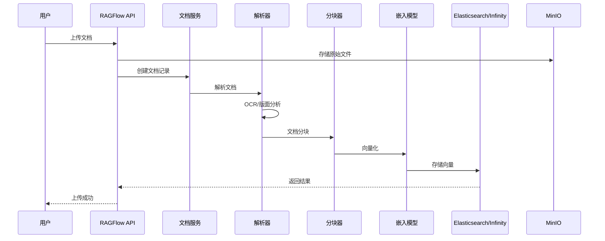

### RAG 检索流程

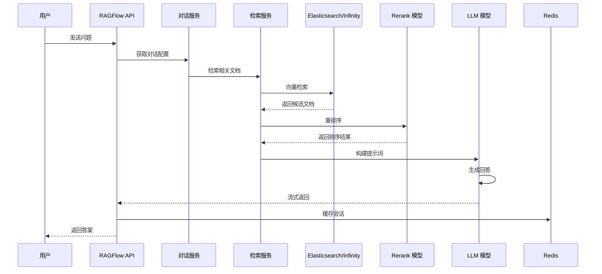

### Agent 工作流执行

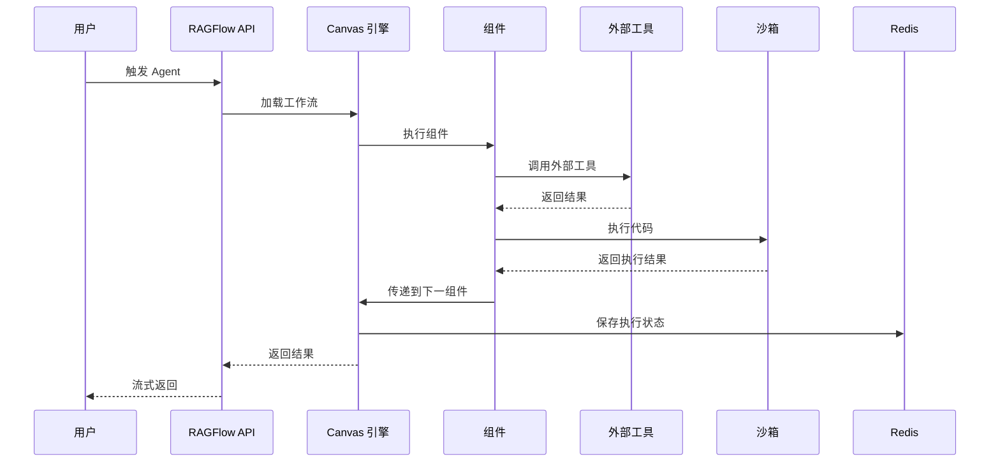

### 用户认证与权限校验流程

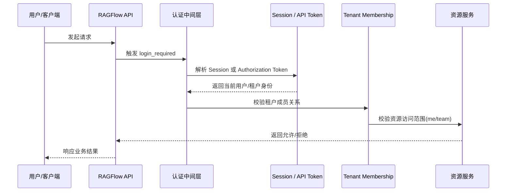

### 知识图谱构建流程

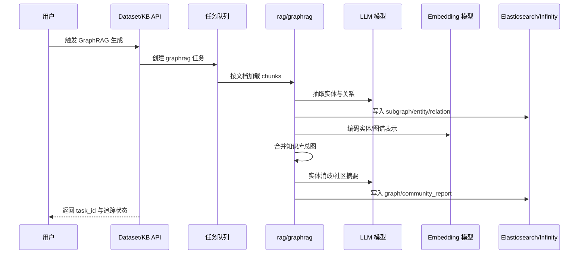

### RAPTOR 生成流程

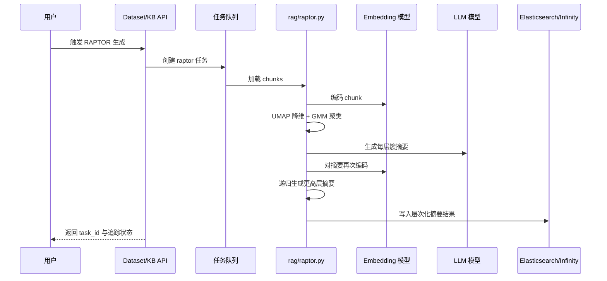

---

## 技术特性

### 支持的 LLM 模型

- **OpenAI**: GPT-3.5, GPT-4, GPT-4o
- **Anthropic**: Claude 系列
- **本地模型**: Ollama, Xinference
- **国内模型**: 通义千问、文心一言、智谱 AI、Moonshot 等
- **开源模型**: Llama, Mistral, Qwen 等

### 支持的向量数据库

- **Elasticsearch** (默认)
- **Infinity** (高性能向量引擎)
- **OpenSearch** (可选)

### 部署模式

- **Docker Compose**: 单机部署
- **CPU 模式**: 适用于开发和小规模部署
- **GPU 模式**: 适用于生产环境和大规模部署

---

## 端口配置

| 服务 | 端口 | 说明 |
|------|------|------|
| Nginx (HTTP) | 80 | Web 前端入口 |
| Nginx (HTTPS) | 443 | HTTPS 入口 |
| RAGFlow API | 9380 | 主 API 服务 |
| Admin Server | 9381 | 管理服务 |
| MCP Server | 9382 | MCP 协议服务 |
| Go Server | 9384 | Go 服务 |
| MySQL | 3306 | 数据库 |
| Redis | 6379 | 缓存 |
| Elasticsearch | 9200 | 向量检索 |
| MinIO | 9000 | 对象存储 |
| Infinity | 23817/23820 | Infinity 向量引擎 |

---

## 关键目录结构

```
ragflow/
├── api/                    # 后端 API
│   ├── apps/              # Flask 应用模块
│   ├── db/                # 数据库模型和服务
│   └── utils/             # 工具函数
├── rag/                   # RAG 核心
│   ├── llm/              # LLM 抽象层
│   ├── nlp/              # NLP 工具
│   ├── flow/             # 文档处理流程
│   └── graphrag/         # 知识图谱
├── agent/                 # Agent 系统
│   ├── component/        # 组件库
│   ├── tools/            # 工具集
│   ├── sandbox/          # 沙箱执行器
│   └── plugin/           # 插件系统
├── deepdoc/              # 文档解析
│   └── parser/           # 各类解析器
├── web/                  # 前端
│   └── src/              # React 源码
├── docker/               # Docker 配置
└── conf/                 # 配置文件
```

---

## 总结

RAGFlow 是一个功能完整的企业级 RAG 系统，具有以下特点：

1. **模块化架构**: 清晰的分层设计，易于扩展和维护
2. **丰富的 API**: 200+ REST API 接口，覆盖所有核心功能
3. **灵活的 Agent 系统**: 可视化工作流编排，支持复杂业务场景
4. **强大的文档处理**: 支持多种文档格式，深度文档理解
5. **多模型支持**: 兼容主流 LLM 和向量数据库
6. **容器化部署**: Docker Compose 一键部署，支持 CPU/GPU 模式
7. **图增强检索**: 提供知识图谱、社区报告和 RAPTOR 分层摘要等高级增强能力

---

**文档生成时间**: 2026-03-24
**RAGFlow 版本**: Latest (Nightly)
